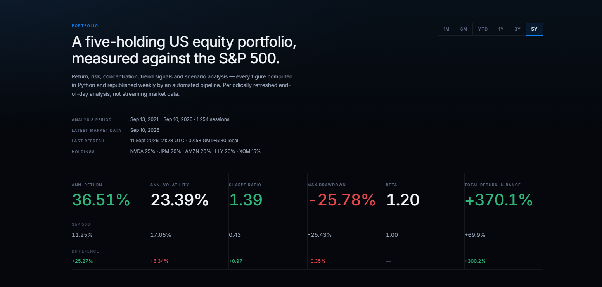
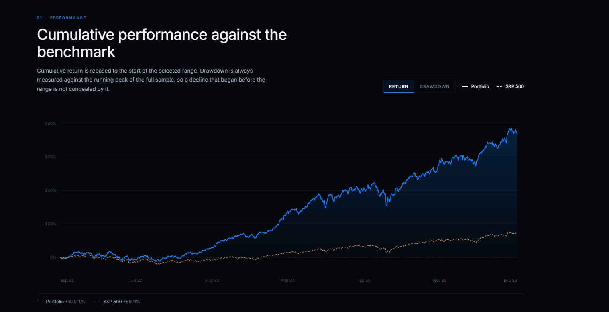
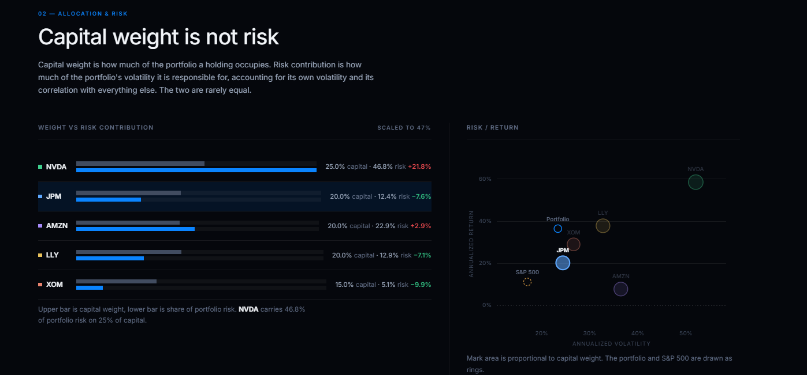
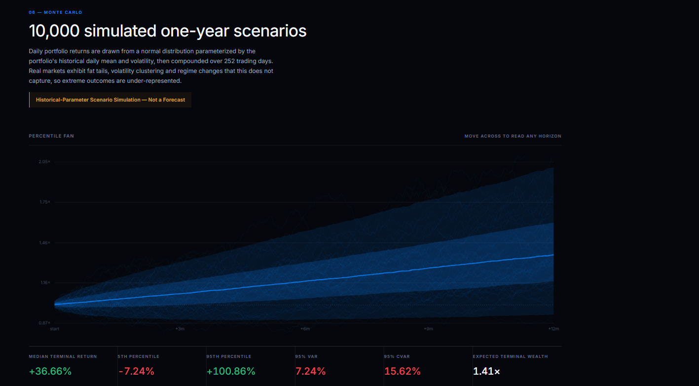

# US Equity Portfolio Analytics & Risk Automation

An automated Python portfolio analytics and risk-monitoring pipeline for a diversified US equity portfolio, combining performance attribution, risk analysis, benchmark comparison, technical signals, strategy backtesting, and Monte Carlo scenario analysis in a live interactive dashboard.

**Data refreshes automatically every week through GitHub Actions — no dashboard figures are manually updated.**

### [View the Live Interactive Dashboard](https://yash-andhrutkar.github.io/US-Equity-Portfolio-Analytics/)

---

## Dashboard Overview



The portfolio tracks five large-cap US equities across technology, financials, consumer, healthcare, and energy:

| Ticker | Company | Weight |
|---|---|---:|
| NVDA | NVIDIA | 25% |
| JPM | JPMorgan Chase | 20% |
| AMZN | Amazon | 20% |
| LLY | Eli Lilly | 20% |
| XOM | Exxon Mobil | 15% |

**Benchmark:** S&P 500 (`^GSPC`)  
**Market data:** Yahoo Finance adjusted daily closes  
**Analysis window:** Rolling 5-year history  
**Refresh:** Weekly, automatically

---

## Key Findings

### 1. Strong historical portfolio performance, with higher risk

Over the displayed five-year sample, the portfolio materially outperformed the S&P 500 on annualized and cumulative return while also carrying higher volatility and market sensitivity.

The dashboard evaluates this trade-off through annualized return, volatility, Sharpe ratio, maximum drawdown, beta, and cumulative performance rather than looking at return in isolation.



The interactive dashboard supports **1M, 6M, YTD, 1Y, 3Y, and 5Y** windows. Metrics for each window are recomputed in Python rather than approximated in the browser.

---

### 2. Capital allocation and risk allocation are materially different

A portfolio weight does not necessarily represent the amount of portfolio risk generated by a holding.

In the displayed five-year analysis, **NVDA represents 25% of portfolio capital but approximately 46.8% of total portfolio risk contribution**, making it the largest source of portfolio risk.

By contrast, several holdings contribute substantially less risk than their capital weights suggest.



The dashboard combines:

- portfolio weights
- Euler risk contribution
- annualized risk/return positioning
- asset correlation
- correlation-distance mapping
- portfolio drawdown

This makes concentration and diversification effects visible beyond simple portfolio weights.

---

### 3. Risk-adjusted performance differs substantially across holdings

Individual securities exhibit very different combinations of return, volatility, beta, drawdown, and Sharpe ratio.

The Asset Explorer allows each holding to be selected globally so its metrics, technical signals, backtest, and related risk analytics update together.

This makes it possible to distinguish between:

- high-return / high-volatility holdings
- defensive contributors
- high-beta exposures
- concentration-risk drivers
- holdings with stronger historical risk-adjusted performance

---

### 4. Moving-average signals can alter the return/drawdown trade-off

The project implements a **50-day / 200-day moving-average framework** with Golden Cross and Death Cross detection.

The strategy backtest applies the trading position with a **one-trading-day lag**, preventing look-ahead bias.

The objective is not to claim that the moving-average strategy is superior. Instead, the analysis evaluates whether trend filtering historically changed:

- cumulative return
- annualized return
- maximum drawdown
- time invested

Transaction costs, slippage, and taxes are not modeled.

---

### 5. Monte Carlo analysis provides scenario-based downside context



The project generates **10,000 simulated one-year portfolio paths over 252 trading days**, parameterized using the historical daily mean and volatility of the portfolio.

Outputs include:

- 5th percentile terminal outcome
- median terminal outcome
- 95th percentile terminal outcome
- probability of simulated loss
- 95% Value at Risk (VaR)
- 95% Conditional Value at Risk (CVaR)
- terminal-return distribution
- percentile paths through the simulation horizon

> **Historical-Parameter Scenario Simulation — Not a Forecast**

The simulation assumes normally distributed returns and therefore does not fully capture fat tails, volatility clustering, regime changes, or structural breaks. Simulated frequencies should not be interpreted as forecasts of future market probabilities.

---

## What I Built

The project combines quantitative portfolio analysis with an automated data and deployment pipeline.

### Portfolio Analytics

- Annualized geometric return
- Annualized volatility
- Sharpe ratio
- Maximum drawdown
- Beta vs S&P 500
- Cumulative portfolio performance
- Portfolio vs benchmark comparison
- Correlation analysis
- Euler risk contribution
- Risk/return analysis

### Technical Analysis

- 50-day moving average
- 200-day moving average
- Golden Cross detection
- Death Cross detection
- Current trend classification
- Crossover history

### Strategy Analysis

- Buy & Hold benchmark
- Moving-average strategy
- One-day signal lag to prevent look-ahead
- Return comparison
- Drawdown comparison

### Scenario & Tail-Risk Analysis

- 10,000-path Monte Carlo simulation
- 252-trading-day horizon
- Percentile paths
- Terminal-return distribution
- VaR
- CVaR
- Simulated loss frequency

### Interactive Dashboard

- Six selectable analysis windows
- Global ticker selection
- Synchronized analytical panels
- Interactive crosshairs and tooltips
- Portfolio/S&P series controls
- MA50/MA200 controls
- Sortable analytics table
- Correlation-distance visualization
- Responsive layout
- Keyboard navigation
- Reduced-motion accessibility

---

## Automated Pipeline

```text
GitHub Actions — Weekly Schedule
          ↓
Fresh Yahoo Finance Data
          ↓
Python Analytics Engine
          ↓
Automated Test Suite
          ↓
Data Freshness Validation
          ↓
Analytics Tables + Charts + Report
          ↓
dashboard_data.json
          ↓
Dashboard Data Validation
          ↓
Hardcoded-Number Guard
          ↓
GitHub Pages Deployment
          ↓
Live Interactive Dashboard
```

The workflow runs every **Saturday at 06:00 UTC (11:30 AM IST)** and can also be triggered manually.

No financial value displayed on the dashboard is manually maintained.

If a test, freshness check, analytics run, payload validation, or other required gate fails, the deployment job does not run and the **previous successful dashboard remains live**.

---

## Data Architecture

The browser reads one generated financial-data source:

```text
docs/data/dashboard_data.json
```

The payload is produced by:

```text
scripts/export_dashboard_data.py
```

The exporter uses the same analytics functions in `src/` used by the main Python pipeline.

Financial calculations are therefore centralized in Python rather than duplicated in JavaScript.

### Validation Layer

Three mechanisms protect data integrity:

**Dashboard validator**

`validate_dashboard_data.py` independently compares the generated dashboard payload against the analytics outputs and processed market data.

**Hardcoded-number guard**

`check_no_hardcoded_numbers.py` checks the frontend for financial figures that should instead originate from the generated data payload.

**Exporter tests**

`tests/test_export_dashboard_data.py` verifies that dashboard values agree with the underlying Python analytics modules.

---

## Methodology

### Market Data

End-of-day adjusted closing prices are downloaded using `yfinance`.

Rows containing missing observations are dropped rather than synthetically filled.

### Returns

Daily simple returns are calculated from adjusted closing prices.

Annualized returns use geometric compounding over **252 trading days**.

### Volatility

Daily return standard deviation is annualized using:

```text
σannual = σdaily × √252
```

### Sharpe Ratio

The project uses a documented **4% annual risk-free-rate assumption** stored in `config.py`.

This is a modeling assumption rather than a live Treasury-rate feed.

### Beta

Beta is estimated relative to the S&P 500 using sample covariance and benchmark variance.

### Risk Contribution

Portfolio risk contribution uses the Euler decomposition:

```text
RCᵢ = wᵢ(Σw)ᵢ / σₚ
```

The component contributions sum to total portfolio risk.

### Moving-Average Signals

The signal model uses:

```text
Short MA = 50 trading days
Long MA  = 200 trading days
```

Crossovers require a genuine transition between the two averages.

### Backtesting

A long position is held when MA50 exceeds MA200.

The position is shifted **one trading day** before being applied to returns to prevent look-ahead bias.

The backtest does not include:

- transaction costs
- slippage
- taxes

### Monte Carlo Simulation

Portfolio daily returns are sampled from a normal distribution parameterized by the portfolio's historical daily mean and standard deviation.

```text
Simulations: 10,000
Horizon:     252 trading days
Seed:        42
```

This is a historical-parameter scenario model, not a predictive model.

---

## Project Structure

```text
US-Equity-Portfolio-Analytics/
│
├── config.py
├── main.py
│
├── src/
│   ├── data_loader.py
│   ├── metrics.py
│   ├── portfolio.py
│   ├── signals.py
│   ├── simulation.py
│   └── visualizations.py
│
├── scripts/
│   ├── export_dashboard_data.py
│   ├── validate_dashboard_data.py
│   └── check_no_hardcoded_numbers.py
│
├── data/
│   ├── raw/
│   └── processed/
│
├── output/
│   ├── charts/
│   ├── tables/
│   └── reports/
│
├── docs/
│   ├── index.html
│   ├── assets/
│   ├── data/
│   └── readme-assets/
│
├── notebooks/
│   ├── 01_data_exploration.ipynb
│   ├── 02_risk_return.ipynb
│   ├── 03_signals.ipynb
│   └── 04_monte_carlo.ipynb
│
├── tests/
│
├── .github/
│   └── workflows/
│       └── weekly_refresh.yml
│
├── requirements.txt
└── README.md
```

---

## Tech Stack

**Analytics**

`Python` · `pandas` · `NumPy` · `SciPy` · `yfinance`

**Visualization**

`Matplotlib` · `Seaborn` · `SVG` · `Canvas`

**Research**

`Jupyter Notebook`

**Testing**

`pytest`

**Dashboard**

`HTML` · `CSS` · `JavaScript`

**Automation & Deployment**

`Git` · `GitHub Actions` · `GitHub Pages`

---

## Run Locally

Clone the repository:

```bash
git clone https://github.com/Yash-Andhrutkar/US-Equity-Portfolio-Analytics.git
cd US-Equity-Portfolio-Analytics
```

Create a virtual environment and install dependencies:

```bash
python -m venv .venv
```

Windows:

```bash
.venv\Scripts\activate
```

macOS/Linux:

```bash
source .venv/bin/activate
```

Install:

```bash
pip install -r requirements.txt
```

Run the analytics pipeline:

```bash
python main.py
```

Run the tests:

```bash
python -m pytest tests -v
```

Generate and validate the dashboard payload:

```bash
python scripts/export_dashboard_data.py
python scripts/validate_dashboard_data.py
python scripts/check_no_hardcoded_numbers.py
```

Preview the dashboard locally:

```bash
python -m http.server 8000 --directory docs
```

Then open `http://localhost:8000`.

---

## Limitations

This project is designed as a portfolio analytics and engineering demonstration.

Important limitations include:

- historical relationships may not persist
- the portfolio weights are predefined rather than optimized
- the risk-free rate is a standing assumption rather than a live feed
- beta and correlations can change materially across market regimes
- the moving-average backtest excludes trading frictions
- the Monte Carlo model assumes normally distributed returns
- simulated outcomes are not forecasts
- historical performance does not predict future performance

---

## Live Project

### [Open the Interactive Portfolio Analytics Dashboard](https://yash-andhrutkar.github.io/US-Equity-Portfolio-Analytics/)

The dashboard is automatically refreshed through the project's GitHub Actions pipeline using updated end-of-day market data.

---

## Disclaimer

This project is for analytics, research, and portfolio demonstration purposes only.

It does not constitute investment advice or a recommendation to buy or sell any security. Historical analysis and simulated outcomes are not forecasts of future performance.